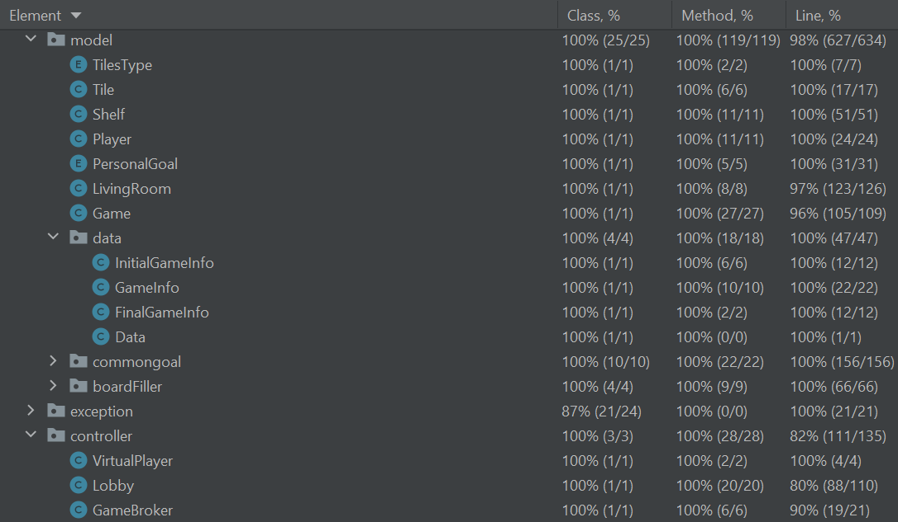

# Versione Italiana

[*My Shelfie*](https://www.craniocreations.it/prodotto/my-shelfie) è un gioco da tavolo creato da _Phil Walker-Harding_ e _Mattew Dunstan_ e pubblicato da _Cranio Creations_.

**Professore**: Alessandro Margara

**Gruppo**: AM25

## Repository per la prova finale del corso "Ingegneria del Software" al Politecnico di Milano
I componenti del gruppo sono Alfano Marco, Boimah Divine, Boisseau Arianna, Cerutti Andrea.

## Setup
Nella cartella [deliverables](deliverables) è pressente il file .jar per eseguire l'applicazione.

Il server può essere eseguito tramite il seguente comando:
~~~
java -jar AM25.jar -Server
~~~
Il client può essere eseguito con i seguenti comandi: 
**Per la TUI**
~~~
java -jar AM25.jar -Tui
~~~
**Per la GUI**
~~~
java -jar AM25.jar -Gui
~~~

Per evitare problemi di visualizzazione della GUI consigliamo di ridurre lo scaling dello schermo a 100% e utilizzare [Fluent Terminal](https://github.com/felixse/FluentTerminal) per la TUI.

## Funzionalità Implementate
| Funzionalità | Stato |
|:-----------------------|:------------------------------------:|
| Regole Semplificate |  |
| Regole Complete |  |
| Socket |  |
| RMI |  |
| TUI |  |
| GUI |  |
| Partite Multiple |  |
| Persistenza |  |
| Resilienza alle disconnessioni|  |
| Chat |  |

#### Legenda

 Non Implementato &nbsp;&nbsp;&nbsp;&nbsp;
 Implementato

## Test e Documentazione
Percentuale di copertura per classi, metodi e linee di codice:

# English Version

[*My Shelfie*](https://www.craniocreations.it/en/product/my-shelfie) a board game designed by _Phil Walker-Harding_ and _Mattew Dunstan_ and published by _Cranio Creations_.

## Repository for the project of the course "Ingegneria del Software" of Politecnico di Milano
The contribuitors are Alfano Marco, Boimah Divine, Boisseau Arianna, Cerutti Andrea.

**Professor**: Alessandro Margara

**Group**: AM25

## Setup
The .jar file to run the application is places in the [deliverables](deliverables) folder.

The server can be run with the following command in a terminal window:
~~~
java -jar AM25.jar -Server
~~~
The client can be run with one of the following command: 
**For TUI**
~~~
java -jar AM25.jar -Tui
~~~
**For GUI**
~~~
java -jar AM25.jar -Gui
~~~

To avoid visualization problems of the GUI we recommend reducing the screen scaling to 100% and using [Fluent Terminal](https://github.com/felixse/FluentTerminal) for the TUI.

## Functionalities

| Functionality | Implemented |
|:-----------------------|:------------------------------------:|
| Simplified rules |  |
| Complete rules   |  |
| Socket           |  |
| RMI     |  |
| TUI |  |
| GUI |  |
| Multiple matches |  |
| Persistence |  |
| Resilience to disconnections|  |
| Chat |  |

#### Legend

 Not Implemented &nbsp;&nbsp;&nbsp;&nbsp;
 Implemented

## Tests and Documentation
Percentage coverages for classes, methods and lines of code:

